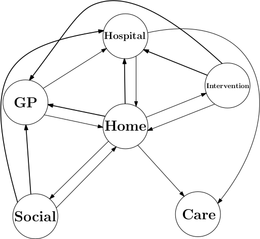
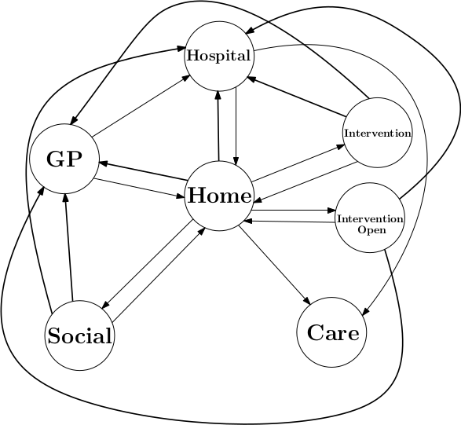

########
Network
########

There are two versions of the network used in the current modelling. The first only features a single Intervention node.
The second features two intervention nodes.

The network centres around the Home node which has connections to and from the Hospital, GP, Social and Intervention
nodes and a connection to the Care node (which is a sink node). The other edges in the system mostly signify falls,
edges to GP from Interventions, Social and Home nodes are there for moderate falls. Likewise the same set of nodes have
edges to Hospital are for severe falls. The last edge from Hospital to Care is like the edge from Home to Care which is
for agents with mobility less than zero.

**************************************
Control and Parameter Setting Network
**************************************

*****************************
Other Specifications Network
*****************************

****************
Node Algorithms
****************

There are many different functions performed in the nodes including perception filtering. We describe the main
algorithms used in individual nodes and fall nodes in general here.

------------
Fall Checks
------------
We use a random number and a normal distribution based on the agents mobility to check for falls. We scale the mean to
check for different sorts of falls.

.. math::
    f_{severe} = e^{-3m}\\
    f_{moderate}=e^{-3(0.9m)}\\
    f_{mild}=e^{-3(0.7m)}

Where :math:`m` is mobility. We sample from a uniform random distribution on the interval [0:1], :math:`r`, and starting with severe we check to see if :math:`r`
is less than :math:`f_{severe}`. If :math:`r` is less than the fall value then we dictate that that type of fall will occur.

------------------
Predicting Falls
------------------
To predict the next fall an agent is going to have we use a poisson distribution for each type of fall. We draw a sample
from each distribution, this sample is the time till the next fall of that type. The first type of fall to occur and the
time to it's occurrence is our fall prediction.

.. math::
    t_{severe} = Pois(-log(1-m))\\
    t_{moderate} = Pois(-log(1-0.9m))\\
    t_{mild} = Pois(-log(1-0.7m))\\
    t_{fall} = min(t_{severe}, t_{moderate}, t_{mild})

--------------------------
Node Perception Filtering
--------------------------
The standard node perception filtering for fall nodes is based on the edges and end nodes available and the properties
of the agent. There are 3 stages of Perception filtering:

1. Remove edges from Perception with\:
    a) wellbeing limits which the agent does not match
    b) referral requirement which the agent does not meet

2. If agent_mobility<0 and Care Node in Perception End Nodes:
    Perception = edge with Care end node

3. Perform fall check, if agent falls set agent_wellbeing to 'Fallen' and log fall, then\:
    a) if Severe fall: Perception = edge with Hospital end node
    b) if Moderate fall: Perception = edge with GP end node

----------------
Home Prediction
----------------
To calculate  how long the agent will stay at the Home node and possibly where it will go,
[queue time (relative to current time :math:`t_c`), destination, duration],  from there we perform the following algorithm:

+ Determine :math:`minimum\_energy` requirement for edges leaving Home node
+ If :math:`agent\_energy < minimum\_energy`:
    + :math:`recovery\_time = (minimum\_energy-agent\_energy)/recovery\_rate`
    + Predict fall on agent\_mobility to get fall_time and fall_type
    + :math:`t = 1`
    + :math:`m = agent\_mobility`
    + while :math:`t <` fall\_time:
        + :math:`m = m +` mobility\_change\\
        + [fall\_time\*, fall\_type\*] = Predict fall on m \\
        + if fall\_time\* < fall\_time:
            [fall\_time, fall\_type] = [fall\_time\*, fall\_type\*]
        + :math:`t = t + 1`
    + if fall\_time < recovery\_time:
        + log fall
        + set agent_wellbeing to 'Fallen'
        + if fall\_type == 'Severe':
            agent queues at [t_c + fall\_time, Hospital, fall\_time]
        + if fall\_type == 'Moderate':
            agent queues at [t_c + fall\_time, GP, fall\_time]
        + if fall\_type == 'Mild':
            agent queues at [t_c + recovery\_time, None, recovery\_time]
    + else:
        agent queues at [t_c + recovery\_time, None, recovery\_time]

+ Else:
    agent queues at [t_c+1, None, 1]

--------------------
Hospital Prediction
--------------------

We predict the time an agent will spend in hospital using a sample from a normal distribution. We set the mean such that
individuals with high mobility or high resources spend on average 5 days in hospital from a severe fall.
.. maths::
    mean = min(-9 min(m, 1)+14, -9(min(r_c, 1)+min(r_m, 1))+14)

where :math:`m` is agent\_mobility, :math:`r_c` is agent_confidence_resources and :math:`r_m` is agent_mobility_resources.

*****
Node
*****

.. automodule:: Fall_nodes
    :members:

*********
Balancer
*********

Balancer algorithm

.. automodule:: Fall_Balancer
    :members:
